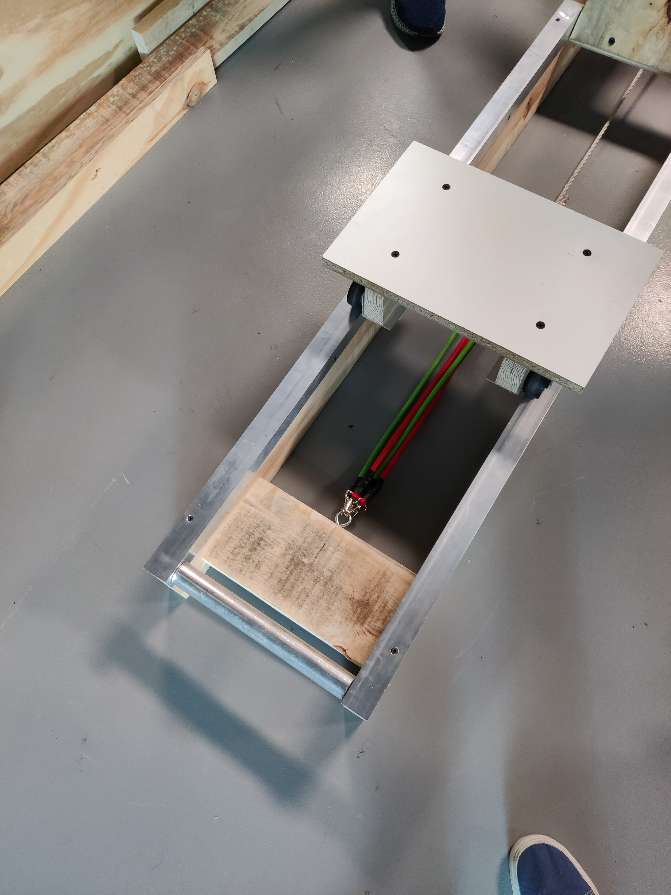
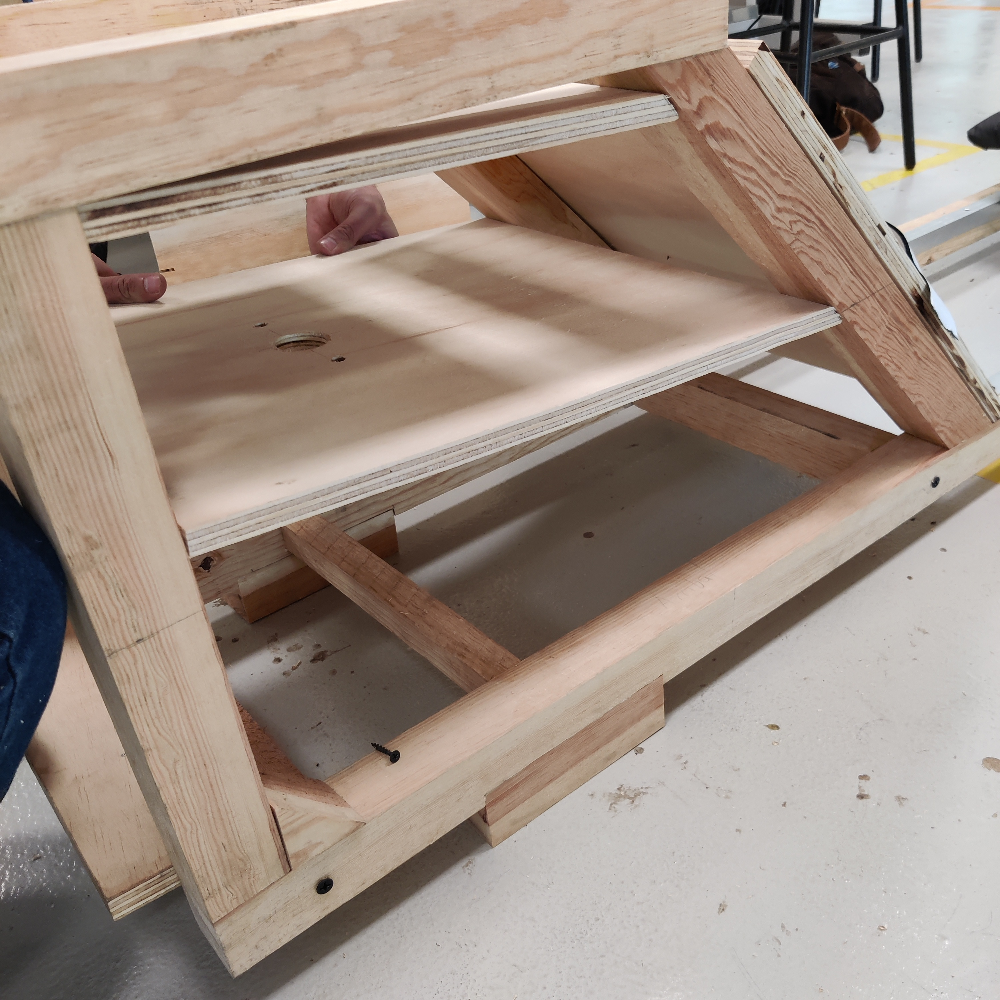
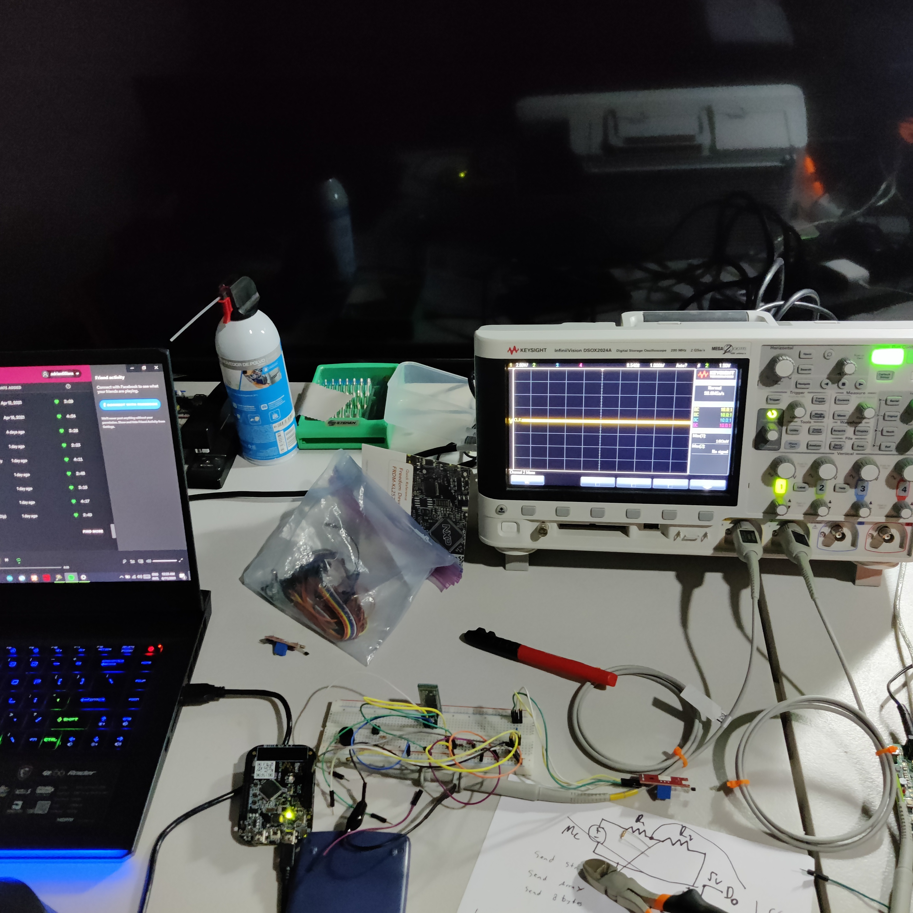
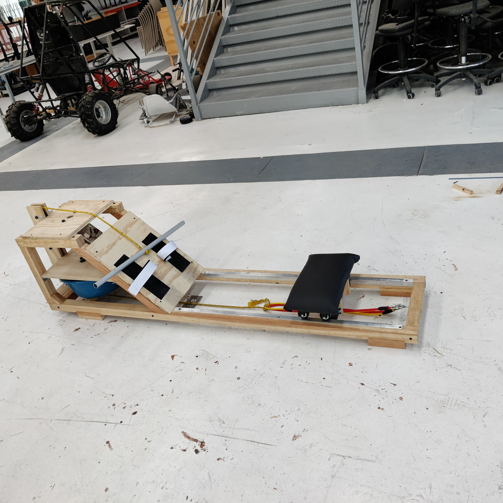
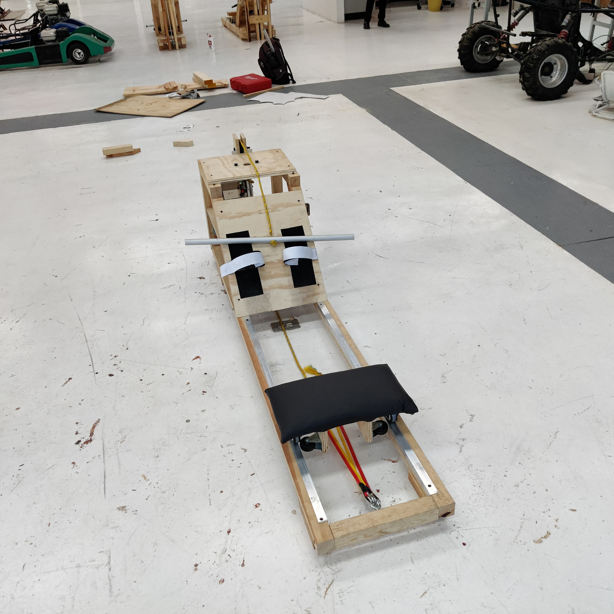
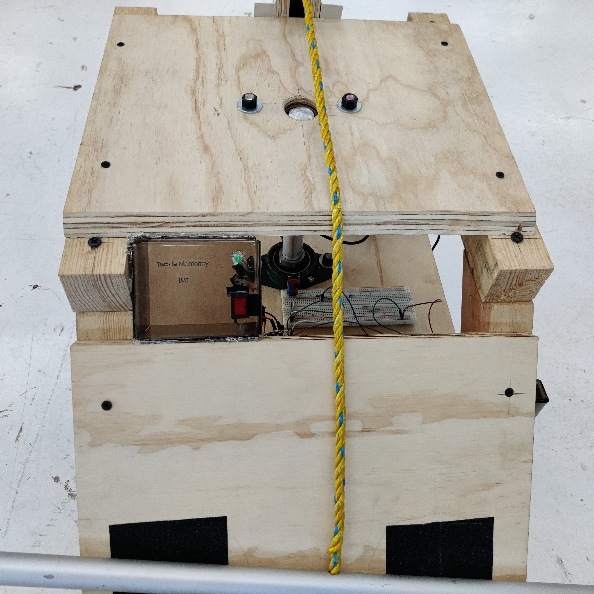
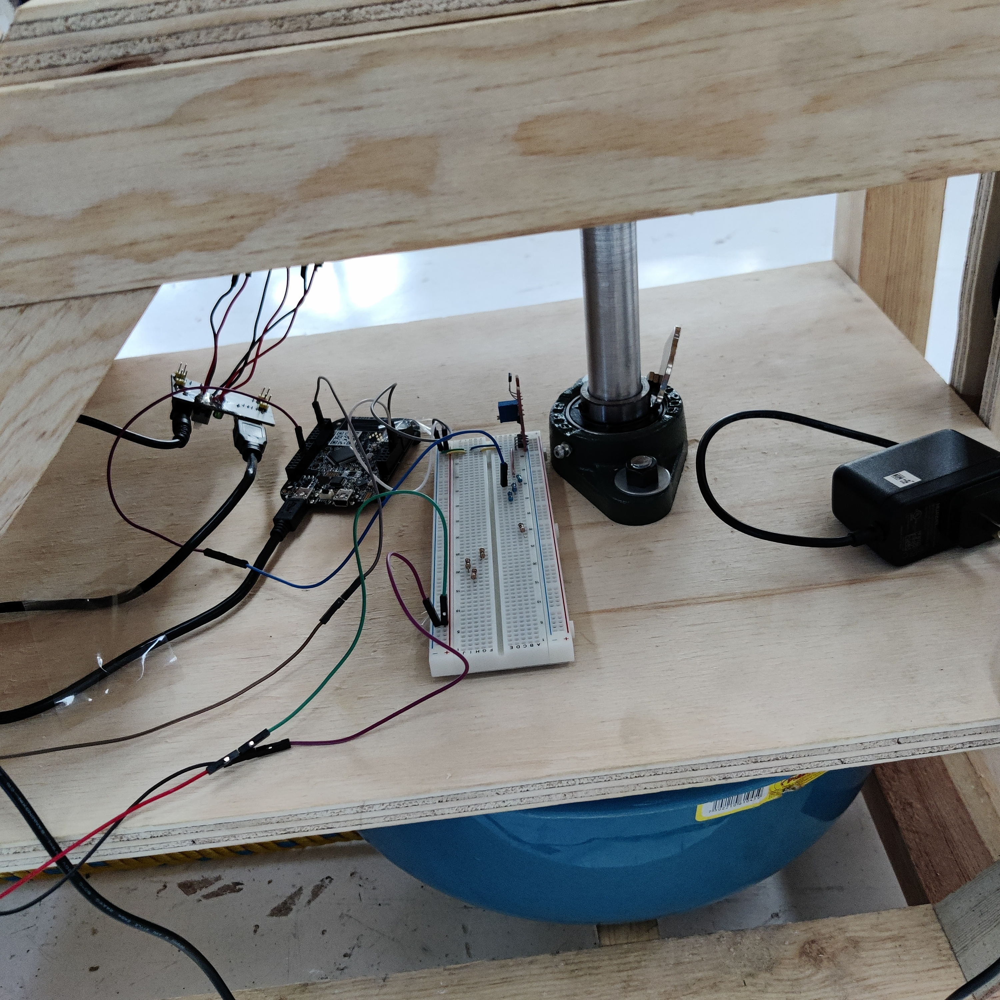
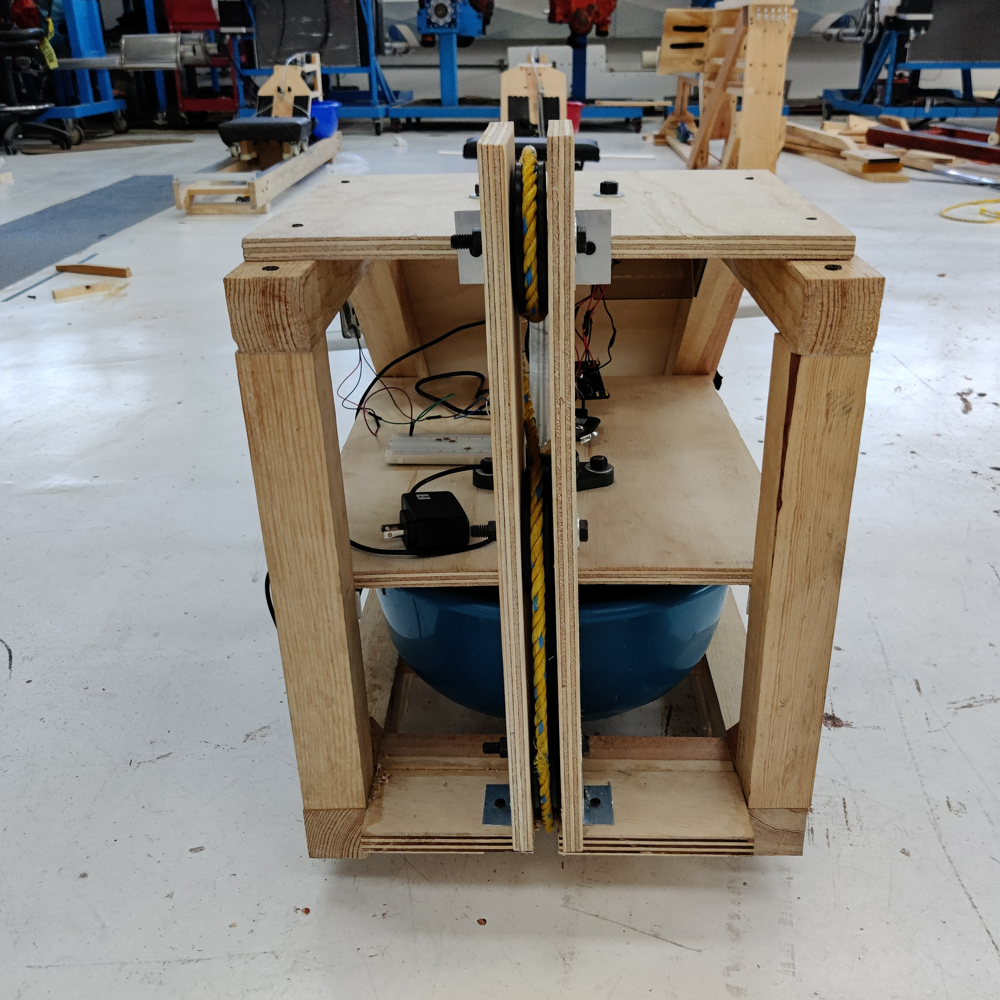

# Rowing-machine
Programed microcontroller (KL25Z) for sensory input and android application for GUI as well as the interface between them (UART and Bluetooth) to log the users’ physical activity in real time. Me main role was to program the machine completely in C. I was in charge of the sensory system the machine had to measure the amount of distance was traveled by the user. To do this a Hall effect sensor was used and by making the microcontroller have hardware and software interrupts; the objective was met. My other role was to create the android app with an integrated data base (Google’s firebase) so the user could operate the machine and have a record of his progress.

# Images

